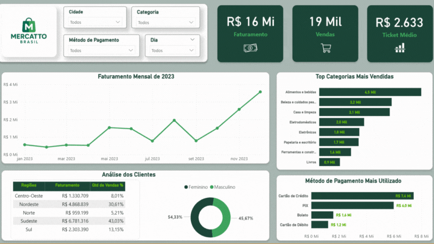

# Projeto de Análise de Dados - Mercatto Brasil (2023)

  

 

## ``Resumo do Projeto``

Este projeto consiste em uma análise de dados da Mercatto Brasil, com foco em vendas e comportamento do consumidor.

Para tal, foram utilizadas consultas em SQL para responder perguntas de negócio e o Power BI para a construção de dashboards interativos que permitem a visualização clara dos números estratégicos da empresa.

Nos arquivos do repositório, você também encontrará uma apresentação com os principais insights levantados durante a análise, como mix de vendas por categoria, perfil dos clientes, métodos de pagamento mais utilizados e concentração geográfica do faturamento.
#
## ``📁 Estrutura do Projeto``

Este projeto contém as seguintes pastas e arquivos:

### 📂 dados
- **Descrição:** Pasta com os dados utilizados na análise.
  - 🗎 `dadoscliente.csv`
  - 🗎 `dadosvendas.csv`

### 📂 imagem
- **Descrição:** Pasta com imagens relacionadas a esta análise.
  - 🗎 `faturamento_por_categoria.png`

### 📂 notebooks
- **Descrição:** Pasta com o arquivo Notebook que contém toda a análise.
  - 🗎 `data_analysis_sql.ipynb`

### 📂 scripts
- **Descrição:** Pasta com arquivos dimensionais da análise.
  - 🗎 `dimensional.py`
  - 🗎 `pipeline.py`

##### 🗎 .gitignore
- **Descrição:** Arquivo para serem ignorados do GtiHub.
##### 🗎 README.md
- **Descrição:** Arquivo para descrever o trabalho dessa análise.
##### 🗎 requirements.txt
- **Descrição:** Arquivo com as bibliotecas importadas do projeto.
#
## ``📈 Etapas Realizadas``

- ``Importação e Limpeza dos Dados(Python)``

  

# 

- ``Visualização dos Dados (Power BI - Deshboard)``

  

#

- ``Modelagem Dados``

  

#link para o deshboard

A modelagem de dados desenvolvida no Power BI foi estruturada no formato estrela, com a tabela fato no centro e tabelas dimensão conectadas a ela:
- Fato_Vendas: concentra os principais indicadores do negócio, como valor total, quantidade de itens, cashback, frete e avaliações das compras.
- Dim_Cliente: traz informações demográficas e geográficas dos clientes, como idade, faixa etária, gênero, cidade, estado e região.
- Dim_Produto: organiza os produtos vendidos por categoria, id do produto e meio de pagamento.
- Dim_Tempo: permite análises temporais, considerando datas completas, ano, mês, semana e dia.

#
## ``🛠️ Ferramentas Utilizadas``

>- __Python__
>- __Jupyter Notebook__
>- __SLQ__
>- __Power BI__
>- __Pandas__
>- __Path__
>- __Numpy__
>- __atplotlib e Seaborn__
>- __Scikit-learn__
#

## ``Aprasentção do Projeto (PDF)``

##apresentação PDF (link)